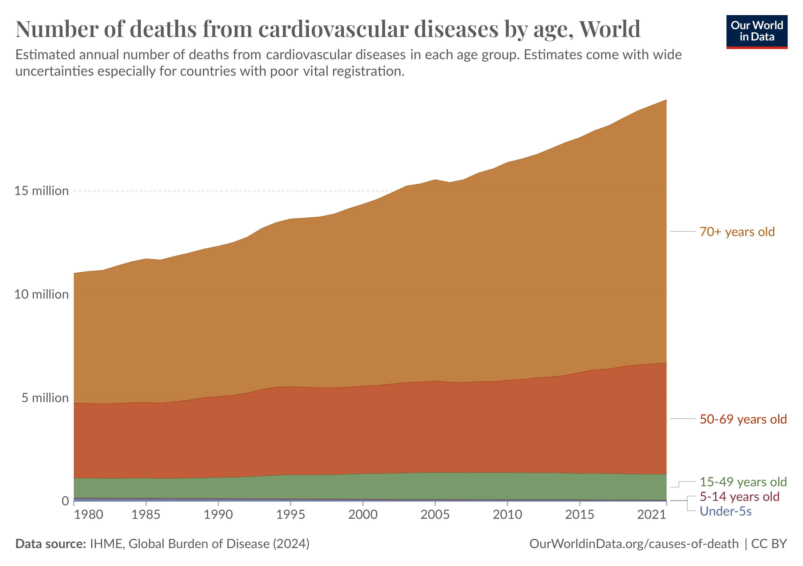
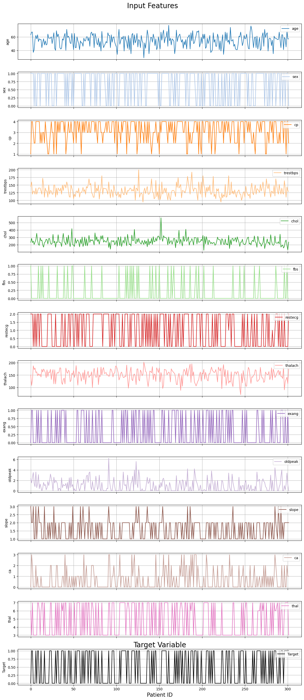
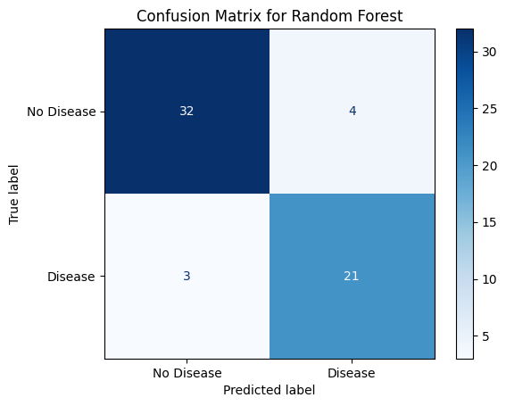
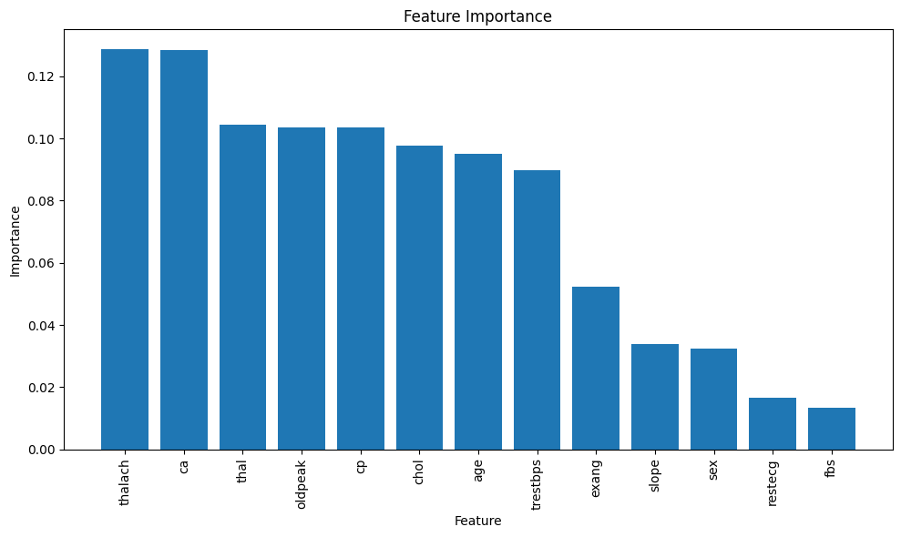
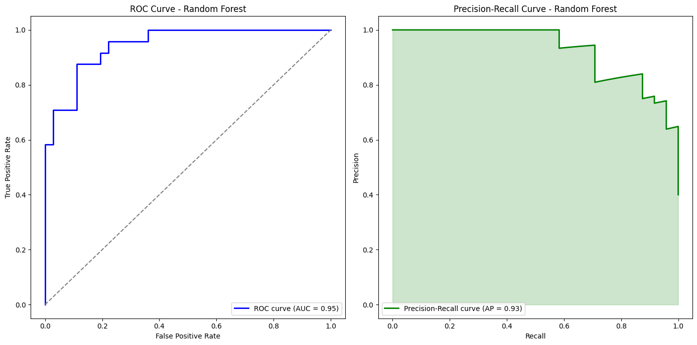
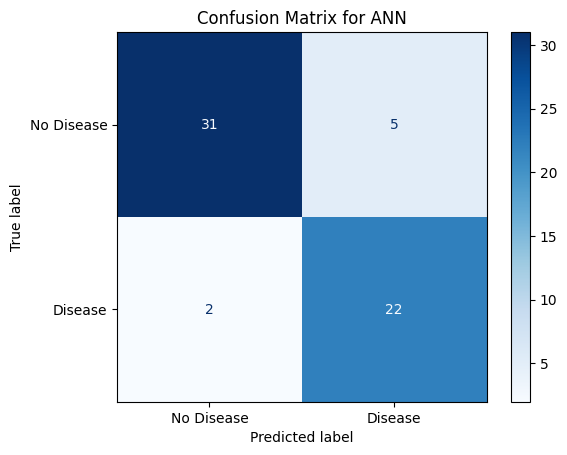
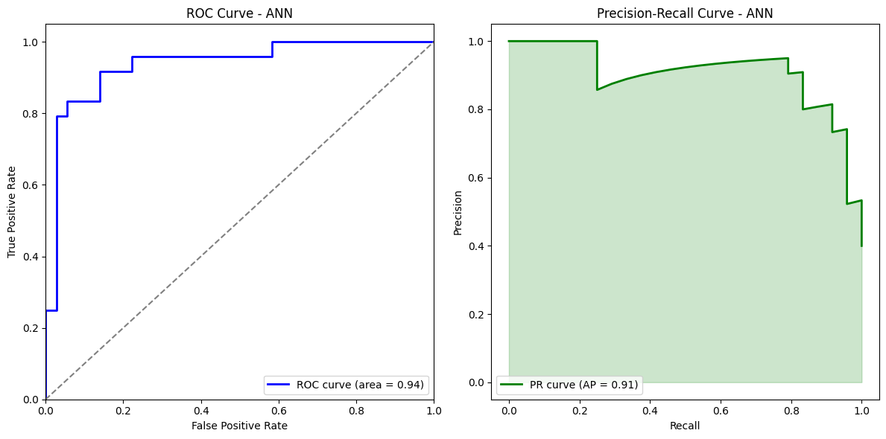

# Final Project : Detecting Heart Disease with Random Forrest and Neural Network

Sattwik Banerjee

Department of Atmospheric and Oceanic Sciences, UCLA

AOS C111: Introduction to Machine Learning for the Physical Sciences

Dr. Alexander Lozinski

December 9, 2024


# Introduction 

Over the past few decades, poor health has risen to be widely acknowledged as one of the main causes of death worldwide and especially in the United States of America. Of the many potential chronic illnesses and diseases, Heart Disease is the leading cause. The usual regimen to fight heart disease is by altering a person’s lifestyle and adding dietary restrictions as often people diagnosed with heart disease have very high levels of cholesterol and blood pressure from a life of unhealthy habits (Jones & Greene, 2013). However the average age of a person diagnosed with heart disease is around 65% for men and 72% for women, with the odds only increasing as time passes (Etudo, 2024). A big question that has been thrown around in the medical field is how can people susceptible to heart disease take preventative care when the average diagnosis age is around ⅔ a person’s life expectancy?

{: width="750" }

*Figure 1: Number of Cardiovascular Deaths by Age Globally.[1]*

One proposed solution to this problem has been deemed to be the implementation of Machine Learning. The field of Machine Learning has been taking the world by storm with the continuous advance in applications of Machine Learning in all aspects of life. As Machine Learning continues to expand its reach, many health care experts believe that with Machine Learning, healthcare can be improved for all, especially in regards to Heart Disease (Baht & Gupta, 2023). In this paper I will explore the application of Machine Learning within the medical field to detect heart disease within a patient.

# Data

The dataset used in this analysis is the Heart Disease Dataset, sourced from the UCI MachineLearning Repository. This dataset contains records from individuals undergoing clinical testing for heart disease. It includes 13 features related to patient demographics, medical history, and clinical measurements, alongside a target variable indicating the presence or absence of heart disease.
The goal is to predict whether an individual has heart disease based on these features, using machine learning techniques.

The input variables present in this dataset are age, sex, chest pain type, resting blood pressure, serum cholesterol, fasting blood sugar, resting electrocardiographic results, maximum heart rate achieved, exercise-induced angina, ST depression, slope of the peak exercise ST segment, number of major vessels, and thalassemia. During the modeling process not all these features will be used to create the models, however they are all a part of the process to prepare the data.

##Preparing the Data

To be able to create the best model and prediction possible, the data must first go through a “preprocessing” stage. In this stage the data is cleaned, meaning that the dataset is thoroughly checked for any and all values that would reduce the accuracy of the Machine Learning Model. For this particular dataset, my preprocessing step began with checking for missing or empty values in the dataset using the command 
```python
X.isna().sum()
```
where X represents the data frame containing the input features. After that command, if there appears to be any NaN values in the set, I then use the command 
```python
X.dropna()
```
to remove the rows that contain those values. 

Next, I make sure that all the features were scaled appropriately to improve the models performance using the code below : 
```python
from sklearn.preprocessing import StandardScaler
scaler = StandardScaler()
X_scaled = scaler.fit_transform(X)
```

Finally, in this dataset the target variable has values from 0-4 where 0 symbolizes no heart disease, and 1-4 represents heart disease within a patient. The values 1-4 serve to display the severity in heart disease, but for the purpose of simply detecting heart disease I will save all values greater than or equal to 1 as 1.

After performing these steps the preprocessing stage has been completed and data is ready to be used to create the models.

{: width="800" }

*Figure 2: Input and Target Data from the UCI Dataset [2].*

# Modelling

I employed two distinct machine learning models to classify the data in my project: a *random forest* and an *artificial neural network* (ANN).

A random forest is an ensemble learning method that combines the predictions of several decision trees to improve overall performance. Given that my data set was labeled, this constitutes a supervised learning classification problem. Specifically, I focused on a binary classification task where the model predicts either 0 (indicating 'no heart disease') or 1 (indicating ‘heart 'disease'). Using scikit-learn’s pre-existing library `RandomForestClassifier`, I implemented the Random Forest parameterized with `n_estimators=150`, `max_depth=15`, `min_samples_leaf=2`, `class_weight='balanced'`. 

For the ANN I utilized the `Tensorflow` library of python, specifically the keras interface. In the construction of the ANN, I chose an architecture of two hidden layers and one dropout layer to prevent overfitting configured with ReLU activations 

```python
model = Sequential([
   Dense(32, activation='relu', input_shape=(X_train.shape[1],)),  # Input layer
   Dense(64, activation='relu'),  # Hidden layer
   Dropout(0.4),  # Dropout layer to prevent overfitting
   Dense(1, activation='sigmoid')  # Output layer for binary classification
])
```
These models were chosen because of their performance in Supervised Binary Classification compared to other Machine Learning Models.

# Results

## Random Forest
After creating and running the Random Forest Model it had an accuracy of 88.3%. Here below are the Confusion Matrix for the model and additionally there is the plot of the most impactful input features on the model.

{: width="600"} {: width="800"}

*Figure 3: Confusion Matrix and Feature Importance for Random Forest.[3]*

Interestingly based on the Feature Importance plot, we see that the two most impactful features in determining whether a patient has heart disease or not are thalach: maximum heart rate achieved and ca: number of major vessels (0-3) colored by fluoroscopy. 
This indicates that the biggest warning signs that a patient might have cardiovascular disease can be determined mainly by a person’s maximum heart rate achieved and number of major vessels (0-3) colored by fluoroscopy along with any combination of the following features. 
Below are the ROC (Receiver Operating Characteristic) curve and the Precision-Recall Curve. These plots serve to better visualize the performance of the model.

{: width="1000"}

*Figure 4: ROC and Precision-Recall Curves for Random Forest.[4]*

On the left is the plot of the ROC Curve, and on the right you see the Precision-Recall Curve. 
These plots help to visualize the performance of a model because of the metrics associated with each plot. For the ROC Curve we have the `AUC` which represents the area under the curve, and for the Precision-Recall Curve we have the `Average Precision` / `(AP)`. Both these metrics are scored on a scale from 0 - 1, the closer to 1 the better especially for Binary Classification tasks such as this one. We see that the `AUC = 0.95` and the `AP = 0.93` which means that the model performed quite well. 

## ANN
For the ANN, after creating and testing the model, it had an accuracy of 88%. Below is the Confusion Matrix for the model. 

{: width="600"}

*Figure 5: Confusion Matrix for ANN.[5]*

When comparing the Confusion Matrices for both models we see that they are indeed quite similar. In both matrices, the false positives/negatives are relatively equal and the correctly predicted negatives and positives are similar as well, which I find to be quite interesting. 
Now below are the ROC and Precision-Recall Curves for the ANN model.

{: width="1000"}

*Figure 6: ROC and Precision-Recall Curve for ANN.[6]*

Once again the plots follow the same format, the left being the ROC and the right being the Precision-Recall. In comparison to the ROC and Precision-Recall for the Random Forest, the ANN performs slightly worse but not by all that much. The `AUC = 0.94` and the `AP = 0.91`. 

Another metric of understanding the accuracy of a machine learning model is the RMSE (Root Mean Squared Error). This metric is also a value on a scale of 0-1 where the closer to 0 the better the accuracy of your model is. Mathematically the RMSE is calculated as such : 

<html>
<head>
  <meta charset="utf-8">
  <meta name="viewport" content="width=device-width">
  <title>MathJax example</title>
  <script id="MathJax-script" async
          src="https://cdn.jsdelivr.net/npm/mathjax@3/es5/tex-mml-chtml.js">
  </script>
</head>
<body>
<p>
\(\text{RMSE} = \sqrt{\frac{1}{n} \sum_{i=1}^n (y_i - \hat{y}_i)^2}\)
</p>
</body>
</html>

Using the `mean_squared_error` application from the scikit-learn library and the `sqrt` application from the math library in python, I calculated the RMSE as such for both models.

```python
# Calculate MSE and RMSE
mse = mean_squared_error(y_test, y_pred)
rmse = sqrt(mse)

print("Root Mean Squared Error (RMSE):", rmse)
```

The RMSE for the Random Forest was 0.342 and for the ANN it was 0.298. Both of these scores are relatively low, indicating an accurate model which is also supported by the ROC and Precision Curves created. 

# Discussion

Although the ANN model has a lower computed RMSE than the Random Forest, based on Figure 4 the Random Forest is shown to be the better model in this scenario although it is not by very much. To say one model is better or far more accurate than the other would be very difficult to say based on the figures above. By comparing the results and accuracy of each model to each other you see there are many more similarities between the two than differences, hence making it difficult to say which one is better for this application than the other. 

The individual performances of each model are exceptional as well as for the Random Forest from Figure 4 having an `AUC = 0.95` and an `AP = 0.93` represents a successfully accurate model. In addition the RMSE for the Random Forest is also low enough to demonstrate that the correlation in accuracy between the predicted values and real values is significant. Additionally for the ANN, from Figure 6 this model has an `AUC = 0.94` and an `AP = 0.91` which are also very good values for those metrics. The RMSE for the ANN model is also significantly low, therefore displaying that there is a high accuracy between the predicted and real values once again. Overall, both the selected models performed very well on performing a Binary Classification on this dataset.

# Conclusion

In this paper, various machine learning models were developed to determine whether a patient has heart disease depending on 13 features relating to each individual patient. The models selected to perform the Binary Classification task within this dataset were a Random Forest and an Artificial Neural Network. These models were developed using Python’s Scikit-Learn and Tensorflow libraries, and they were evaluated by utilizing the ROC Curve, Precision-Recall Curve, and the Root Mean Squared Error. 

After evaluating the models based on the three calculated metrics we see that in comparison, the models performed very similarly. However, the Random Forest performed slightly better as can be seen in the previous Figures. The Figures show a greater overall accuracy and Area Under the Curve as well as Average Precision when compared to the Artificial Neural network although the Random Forest was slightly less accurate when comparing each model's RMSE value. An argument can be made for both models as all metrics demonstrate the success in each model’s performance in classifying heart disease. 

Future studies could build upon this and take the process one step further and apply Deep Learning Techniques to images of Hearts in combination with the development of a more accurate Machine Learning Model. Additionally, after more time has passed and more data has been accumulated, given more factors could lead to a more extensive analysis on important factors that have the most effect on a patient’s diagnosis.  

# References

   1. **Etudo, M.** (2024, July 22). *Heart attack age: Risk by age group*. Medical News Today. [Link](https://www.medicalnewstoday.com/articles/heart-attack-age-range#:~:text=Statistics%20from%20the%20American%20Heart,attacks%20can%20happen%20to%20anyone)

   2. **Jones, D. S., & Greene, J. A.** (2013, July). *The decline and rise of coronary heart disease: Understanding public health catastrophism*. American Journal of Public Health. U.S. National Library of Medicine. [Link](https://pmc.ncbi.nlm.nih.gov/articles/PMC3682614/)

   3. **Bhatt, C. M., Bansal, S., & Gupta, P.** (2023, February 6). *Effective heart disease prediction using machine learning techniques*. MDPI. [Link](https://www.mdpi.com/1999-4893/16/2/88#:~:text=Using%20machine%20learning%20to%20classify,fatality%20caused%20by%20cardiovascular%20diseases)

   4. **Our World in Data.** (n.d.). *Number of deaths from cardiovascular diseases by age*. Our World in Data. [Link](https://ourworldindata.org/grapher/cardiovascular-disease-deaths-by-age). Accessed November 30, 2024.


